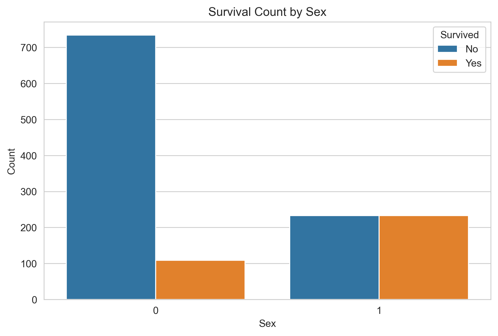
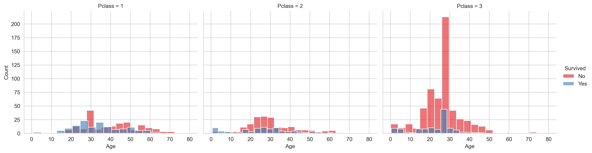
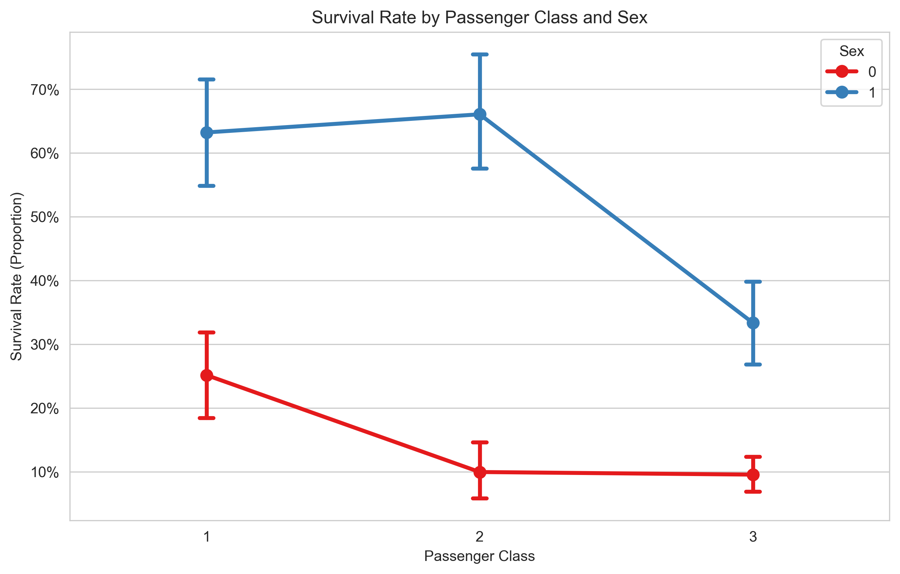

# Basic Data Analysis & Visualization: The Titanic Disaster

## Project Description
This project is a comprehensive exploratory data analysis (EDA) and visualization of the Titanic passenger dataset. The goal was to practice the full data analysis lifecycle—from data acquisition and cleaning to exploration, visualization, and storytelling—to uncover the factors that influenced a passenger's chance of survival.

The final output is this Jupyter Notebook, which demonstrates proficiency in Python, Pandas, NumPy, Matplotlib, and Seaborn.

## Key Questions Explored
1.  **Did a passenger's sex influence their chance of survival?**
2.  **How did a passenger's class (`Pclass`) and age (`Age`) together influence their chance of survival?**

## Dataset
The dataset used is a version of the classic [Titanic dataset](https://www.kaggle.com/c/titanic/data), containing details for 1,309 passengers, including features like:
- `2urvived`: Whether the passenger survived (0 = No, 1 = Yes)
- `Pclass`: Passenger class (1 = 1st, 2 = 2nd, 3 = 3rd)
- `Name`, `Sex`, `Age`, `SibSp`, `Parch`, `Ticket`, `Fare`, `Cabin`, `Embarked`

## Technologies Used
- **Python 3.9**
- **Jupyter Notebook**
- **Libraries:** Pandas, NumPy, Matplotlib, Seaborn, Plotly

## Setup and Installation
To run this project locally, follow these steps:

1.  **Clone the repository:**
    ```bash
    git clone https://github.com/PranavSync/basic-data-analysis-titanic.git
    cd basic-data-analysis-titanic
    ```

2.  **Create and activate the Conda environment** using the provided `environment.yml` file:
    ```bash
    conda env create -f environment.yml
    conda activate titanic-analysis
    ```

3.  **Launch Jupyter Lab:**
    ```bash
    jupyter lab
    ```
4.  Open the `titanic_analysis.ipynb` notebook and run the cells.

*(We will create the `environment.yml` file in the next step)*

## Key Findings and Insights

### 1. The Impact of Sex on Survival
- **Conclusion:** A passenger's sex was a major factor in survival.
- **Insight:** The survival rate for females was **50%**, while for males it was only **12.9%**. This strongly reflects the "women and children first" protocol followed during the evacuation.
- **Visualization:** A bar plot clearly shows the significant difference in survival rates between the two groups.



### 2. The Combined Impact of Class and Age on Survival
- **Conclusion:** While "women and children first" was a guiding principle, a passenger's wealth (represented by `Pclass`) was an equally, if not more, powerful determinant of their fate.
- **Insights:**
  - **First Class:** Had the highest overall survival rate. Older passengers were more likely to die, but many of all ages survived. Wealth provided a significant, though not absolute, shield.
  - **Second Class:** Showed a stronger application of "children first," but survival chances for adults were markedly lower than in First Class.
  - **Third Class:** The protocol largely failed. There was a massive number of deaths across all ages. For adults in Third Class, their class was the overwhelming determinant of their fate, with age mattering very little. The data shows a huge number of middle-aged victims.
- **Visualization:** A faceted histogram revealed the starkly different age distributions of survivors and non-survivors within each class.



### 3. Overall Survival by Class and Sex
- **Conclusion:** Class and Sex were the two most powerful, interacting factors.
- **Insight:** For any given class, females had a higher survival rate than males. For any given sex, being in a higher class drastically improved your chances.
- **Visualization:** A point plot effectively summarizes this interaction.



## Project Structure
```bash
$ tree basic-data-analysis-titanic/
basic-data-analysis-titanic/
├── data
│   └── titanic.csv
├── images
│   ├── survival_by_sex.png
│   ├── age_by_class_survival.png
│   └── survival_by_class_sex.png
├── titanic_analysis.ipynb
├── environment.yml
└── README.md

2 directories, 7 files
```

## References
- [Titanic - Machine Learning from Disaster | Kaggle](https://www.kaggle.com/c/titanic)
- [Seaborn Documentation](https://seaborn.pydata.org/)
- [Pandas Documentation](https://pandas.pydata.org/docs/)
